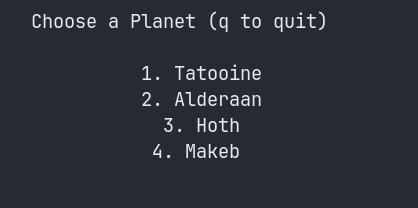

# SDroid - Seeker Droid(™) Emulator

A lightweight terminal-based, resource-gathering game inspired by the simple, satisfying "fishing" mechanics of the 'Seeker Droid' in Star Wars: The Old Republic.

## Description

**SDroid** is a simple "grind" game where you deploy a GSI Seeker Droid(™) to explore dig sites on various planets, uncover hidden treasures, and harvest biological materials from local fauna. The resources you collect—**Salvage** and **Biochemicals**—are saved to a persistent file (`resources.json`) to be tracked and possibly used in other applications or homebrew SWTOR-inspired games (or just to watch numbers go up if that's your thing).

The game is designed to capture the relaxing, low-stress gameplay loop of gathering resources without the need to load a full-scale MMO.


## Features

*   **Procedurally Generated Maps:** Every dig site is a unique, field with many obstacles, providing a new experience every time.
*   **Explore and Discover:** Use your Seeker Droid(™)'s scanner to pinpoint the location of hidden minor and major treasures.
*   **Simple Combat:** Encounter and defeat native creatures to harvest valuable Biochemicals.
*   **Persistent Resources:** All `Salvage` and `Biochemicals` you collect are saved in a simple `resources.json` file. Just ammend the counts in the file (or delete it altogether) if you use the resources elsewhere (and if continuity is important to you).
*   **Daily Resets:** Dig sites are automatically reset every day at 10 PM AEST (Australian Eastern Standard Time), allowing for fresh treasure hunts.
*   **Passive Healing:** Your character slowly heals over time, rewarding careful exploration and tactical disengagement from combat.

## How to Play

### The User Interface

The UI is simple and designed to give you all the vital information at a glance. At the top of the screen, you will see your current Health, total Salvage, and total Biochemicals.

### Controls

| Key(s) | Action |
| :--- | :--- |
| `e` or `Arrow Up` | Move Up |
| `d` or `Arrow Down` | Move Down |
| `s` or `Arrow Left` | Move Left |
| `f` or `Arrow Right` | Move Right |
| `spacebar` | Use Scanner |
| `q` | Quit to Menu |

### The Gameplay Loop

1.  **Select a Planet and Dig Site:** Choose where you want to explore from the list of available locations.




2.  **Explore the Map:** Move your character (`@`) around the map to find a good spot to scan.

3.  **Scan for Treasure:** Press the `spacebar` to activate the Seeker Droid(™).


*   A **large red ring** indicates that the nearest treasure is far away. Move to a new area and try again.   
 


*   A **small green ring with an 'X'** indicates that a treasure is nearby. The 'X' points in the precise direction of the treasure. 
   


4.  **Find the Treasure:** Follow the direction of the green 'X'. When you are standing on or right next to the treasure and use the roid, you will automatically dig it up and collect the Salvage.

5.  **Harvest Fauna:** Defeat local creatures to collect Biochemicals. **Creatures have an agro range and will pursue for a short distance**.
	* `Womp Rats` (`W`) on Tatooine
	* `Kath Hounds` (`K`) on Alderran,
	* `Tauntauns` (`T`) on Hoth
	* `Vrakes` (`V`) on Makeb 


## Setup and Installation

### Requirements

*   **Environment:** A Unix-like terminal environment is required. This includes Linux, macOS, or Windows Subsystem for Linux (WSL). The game **will not** run in the standard Windows Command Prompt or PowerShell due to its reliance on the `curses` library.
*   **Dependencies:** Python 3 is the only requirement. The game uses only standard Python libraries, so no `pip install` commands are necessary.

### Running the Game

1.  Navigate to the project directory in your terminal.
2.  Run the following command:

    ```bash
    python3 seeker_droid.py
    ```

## File Structure

The game automatically creates and manages two JSON files in the same directory as the script.

*   `gamedata.json`: This file stores the state of all dig sites. It tracks which major treasures have been found and marks the sites as "depleted" until the next daily reset.
*   `resources.json`: This is your inventory. It stores a simple count of the total `Salvage` and `Biochemicals` you have collected across all play sessions.

The expected directory structure will look like this after running the game for the first time:

```
.
├── seeker_droid.py
├── gamedata.json
└── resources.json
```
